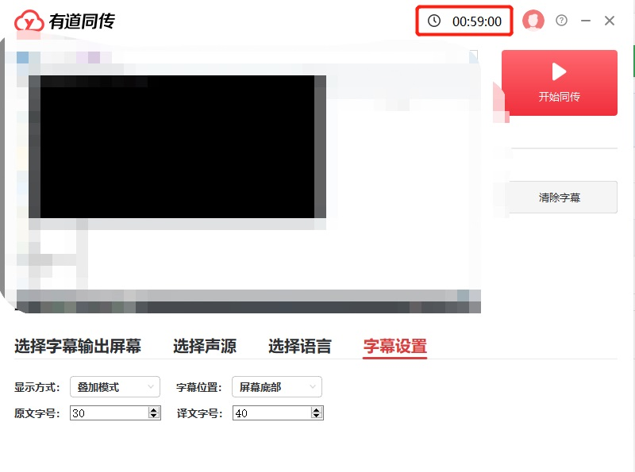
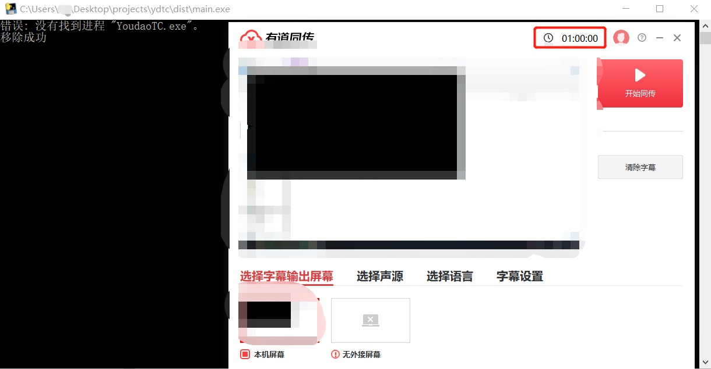

# youdaoTC

## 描述

使用有道同传时发现免费使用时间是由本地计量，顺手写个脚本破解。
BTW：每个帐号每天有1小时的免费使用时间。

## :hearts: windows使用方法
1、下载并安装有道同传
2、登录自己的帐号
3、下载dist文件夹下的三个文件到本地，并放置在同一目录下
4、打开init.ini，将里面的`remainingtime.dat`和`YoudaoTC.exe`路径修改为自己本机的路径（不要用`记事本`打开、不要用`记事本`打开、不要用`记事本`打开）
5、运行main.exe
6、每当免费使用时间用完时，重新运行main.exe

## :yum: 使用前

## :yum: 使用后

